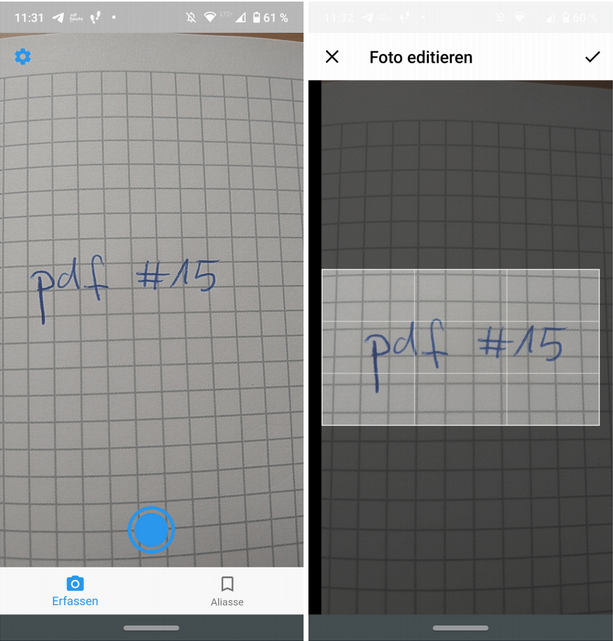

As part of my [bachelor thesis][thesis] I implemented a software prototype containing two components:

1. An desktop component based on Express (Node.js) which acts as a server ([corresponding repository](https://github.com/Anudin/desktop-client))
2. An Android app based on Flutter which acts as a client (_this repository_)

## The concept

- People use more and more digital media but may be forced (or prefer) to work with paper in some areas
- It would be nice to have a resolution mechanism from paper to digital content - something like a QR code but suitable for handwriting
- Instead of a QR code let the user define a _short word_ which can be written on paper and _assign it an URL_ (1)
- The mobile app can be used to scan the written _word_ (2), whatever content is associated with the _assigned URL_ will automatically be displayed in a suitable fashion

(1):

(2):

Additionally the concept describes a mechanism to refer to a specific part of digital content (like a page number for PDF files, or a timestamp for video content - also implemented). This mechanism is also suitable for handwriting.  
Further details can be found in my [thesis][thesis] (only available in German).

## Implementation

Mobile app:

- Obtain OCR text of the written _word_ via Google Cloud Vision
- Check which _URL_ was assigned to the _word_ and send it to the desktop component
  - Server availability in the local network is discovered via Android NDS and communication is handled with a simple REST call

Desktop component:

- Applies some processing based on the MIME type of the resource and resolves the _URL_
- Displays the content in a locally installed web browser

[thesis]: https://www.dropbox.com/s/h9x94r1b29d0z77/bachelorarbeit.pdf?dl=0
